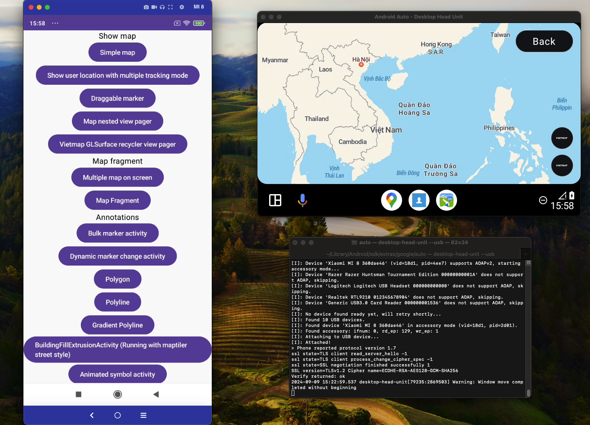
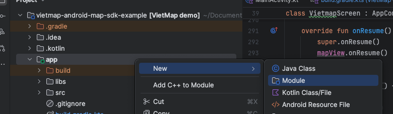
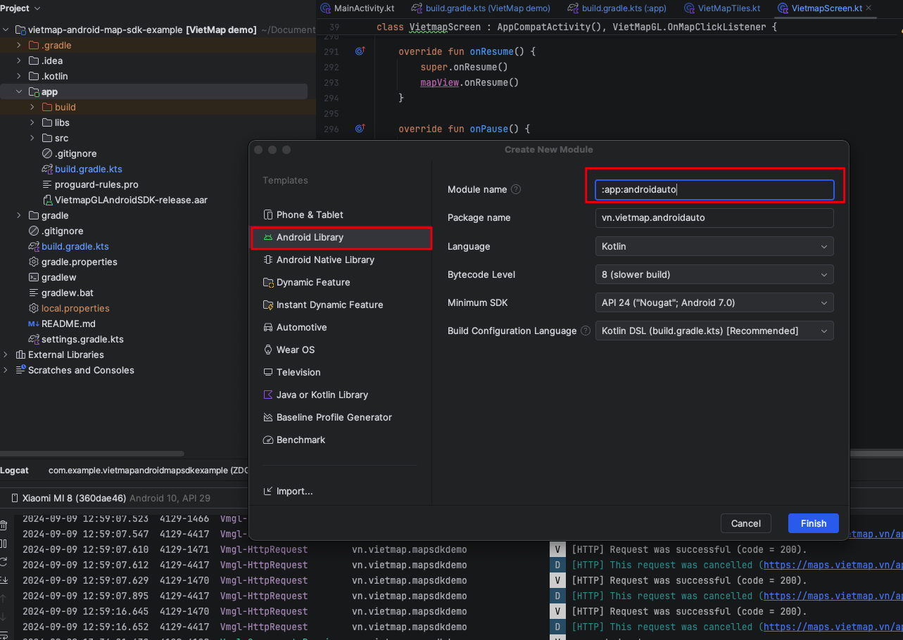
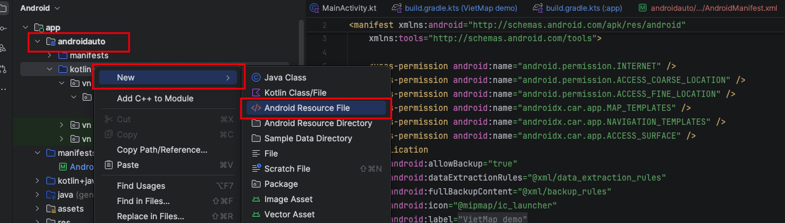
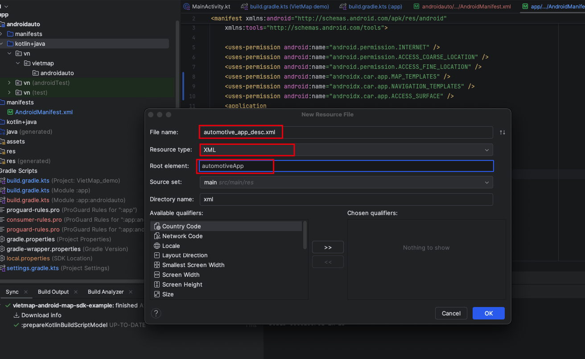

This SDK only work with Vietmap Android Map SDK v3.1.0 and above. 
Please make sure you have already integrated Vietmap Android Map SDK before using this SDK.

Please follow the Android Auto official implementation guide documentation [here](https://developer.android.com/codelabs/car-app-library-fundamentals#0)

This SDK will return the map as a surface view, you can add it to your Android Auto layout as a surface view.


## Android auto implementation guide
### 1. Create new module for Android Auto (inside the `app` module)

### 2. Select Android Library and change module name to "androidauto"

### 3. Add the following dependencies to the build.gradle file of the `app`
```gradle
dependencies {
    implementation project(':app:androidauto')
}
```
### 4. Add the following permission to the AndroidManifest.xml file of the `app`
```xml
    <uses-permission android:name="androidx.car.app.MAP_TEMPLATES" />
    <uses-permission android:name="androidx.car.app.NAVIGATION_TEMPLATES" />
    <uses-permission android:name="androidx.car.app.ACCESS_SURFACE" />
```
### 5. Add the following metadata to the AndroidManifest.xml file of the `app` (Inside the application tag)

```xml
    <meta-data
        android:name="com.google.android.gms.car.application"
        android:resource="@xml/automotive_app_desc" />
```
### 6. Create a new xml file named `automotive_app_desc.xml` in the `androidauto/res/xml` folder of the `androidauto` module.


Copy the following code to the `automotive_app_desc.xml` file
```xml
<?xml version="1.0" encoding="utf-8"?>
<automotiveApp>
    <uses name="template"/>
</automotiveApp>
```
### 7. Add below dependencies to the build.gradle file of the `app:androidauto` module
```gradle
dependencies{
    implementation("androidx.car.app:app:1.3.0-rc01")
    implementation("com.github.vietmap-company:maps-sdk-android:3.1.0")
    implementation("com.github.vietmap-company:vietmap-android-auto:1.5.0")
}
```

In setting.gradle file of the project, add the following line
```gradle
    maven { url = uri("https://www.jitpack.io" ) }
```
Like this
```gradle
dependencyResolutionManagement {
    repositoriesMode.set(RepositoriesMode.FAIL_ON_PROJECT_REPOS)
    repositories {
        google()
        mavenCentral()
        maven { url = uri("https://www.jitpack.io" ) }
    }
}
```
### 8. Create new screen named `VietMapCarAppScreen` extends `Screen` in the `androidauto` module
```kotlin

class VietMapCarAppScreen(
    carContext: CarContext,
    private val mSurfaceRenderer: VietMapAndroidAutoSurface,
) : Screen(carContext) {

    private var vietmapGL: VietMapGL? = null

    private val mSurfaceCallback: SurfaceCallback = object : SurfaceCallback {
        // Handle surface callback event here
    }
    init {
        mSurfaceRenderer.addOnSurfaceCallbackListener(mSurfaceCallback)
        mSurfaceRenderer.init(
            Style.Builder()
                .fromUri("https://maps.vietmap.vn/api/maps/light/styles.json?apikey=YOUR_API_KEY_HERE"),
            OnMapReadyCallback {
                vietmapGL = it
            }
        )
    }

    override fun onGetTemplate(): Template {
        val builder = NavigationTemplate.Builder()
        builder.setBackgroundColor(CarColor.SECONDARY)

        // Set the action strip.
        val actionStripBuilder = ActionStrip.Builder()
        actionStripBuilder.addAction(
            Action.Builder()
                .setTitle("Back")
                .setIcon(
                    CarIcon.Builder(
                        IconCompat.createWithResource(
                            carContext,
                            R.drawable.ic_menu_my_calendar
                        )
                    ).build()
                ).setOnClickListener {
                    val screenManager: ScreenManager =
                        carContext.getCarService(ScreenManager::class.java)
                    screenManager.pop()
                }
                .build()
        )

        builder.setActionStrip(actionStripBuilder.build())

        // Set the map action strip 
        val panIconBuilder = CarIcon.Builder(
            IconCompat.createWithResource(
                carContext,
                R.drawable.ic_menu_add
            )
        )
        builder.setMapActionStrip(
            ActionStrip.Builder()
                .addAction(
                    Action.Builder(Action.PAN)
                        .setIcon(panIconBuilder.build())
                        .build()
                )
                .addAction(
                    Action.Builder()
                        .setIcon(
                            CarIcon.Builder(
                                IconCompat.createWithResource(
                                    carContext,
                                    R.drawable.ic_menu_add
                                )
                            )
                                .build()
                        )
                        .setOnClickListener {
                            //TODO: Add your code here
                        }
                        .build())
                .addAction(
                    Action.Builder()
                        .setIcon(
                            CarIcon.Builder(
                                IconCompat.createWithResource(
                                    carContext,
                                    R.drawable.btn_minus
                                )
                            )
                                .build()
                        )
                        .setOnClickListener {
                            //TODO: Add your code here
                        }
                        .build())
                .build())

        return builder.build()
    }
}
```
### 9. Create new service named `VietMapCarAppSession` extends `Session` in the `androidauto` module
```kotlin
class VietMapCarAppSession:Session() {
    override fun onCreateScreen(intent: Intent): Screen {
        Vietmap.getInstance(carContext)
        val mNavigationCarSurface = VietMapAndroidAutoSurface(carContext, lifecycle)
        val screenMap = VietMapCarAppScreen(carContext,mNavigationCarSurface)
        return screenMap
    }
}
```
### 10. Create new service named `VietMapCarAppService` extends `CarAppService` in the `androidauto` module
```kotlin
class VietMapCarAppService : CarAppService() {
    override fun createHostValidator(): HostValidator {
        return HostValidator.ALLOW_ALL_HOSTS_VALIDATOR
    }

    override fun onCreateSession(): Session {
        return VietMapCarAppSession()
    }
}
```
### 11. Update the `AndroidManifest.xml` file of the `androidauto` module
```xml
<?xml version="1.0" encoding="utf-8"?>
<manifest xmlns:tools="http://schemas.android.com/tools"
    xmlns:android="http://schemas.android.com/apk/res/android">
    <!--
        This AndroidManifest.xml will contain all of the elements that should be shared across the
        Android Auto and Automotive OS versions of the app, such as the CarAppService <service> element
    -->

    <application>

        <meta-data
            android:name="androidx.car.app.minCarApiLevel"
            android:value="1" />
        <meta-data
            android:name="com.google.android.gms.car.application"
            android:resource="@xml/automotive_app_desc" />
        <service
            android:name="vn.vietmap.androidauto.services.VietMapCarAppService"
            android:exported="true">
            <intent-filter>
                <action android:name="androidx.car.app.CarAppService" />
                <category android:name="androidx.car.app.category.POI" />
            </intent-filter>
        </service>

        <activity
            android:name="vn.vietmap.androidauto.VietMapCarAppScreen"
            android:label="Preferences"
            android:exported="true"
            tools:ignore="Instantiatable">
            <intent-filter>
                <action android:name="vn.vietmap.androidauto.VietMapCarAppScreen" />
                <category android:name="android.intent.category.DEFAULT" />
            </intent-filter>
        </activity>
    </application>
</manifest>
```

## Test the app
#### 1. Please following this official documentation from Google about Desktop Head Unit (DHU) [here](https://developer.android.com/training/cars/testing/dhu?authuser=1)
SDK location:

MacOS:
`/Users/<username>/Library/Android/sdk`

Windows:
`C:\Users\<username>\AppData\Local\Android\sdk`

Linux:
`/home/<username>/Android/Sdk`

CD to the DHU folder
```shell
cd SDK_LOCATION/extras/google/auto
```

Run the DHU
```shell
desktop-head-unit.exe   # Windows
./desktop-head-unit     # macOS or Linux
```

#### 2. Start the DHU
#### 3. Connect the real device to the DHU
#### 4. Run the app on the real device
#### 5. Open the Android Auto app on the DHU

## Some useful functions
- Create a new instance of the VietMapAndroidAutoSurface
```kotlin
    val mNavigationCarSurface = VietMapAndroidAutoSurface(carContext, lifecycle)
```

- Init the VietMapAndroidAutoSurface with the style
```kotlin
    mNavigationCarSurface.init(
        Style.Builder()
            .fromUri("https://maps.vietmap.vn/api/maps/light/styles.json?apikey=YOUR_API_KEY_HERE")
    )
```
- Add onMapReady callback (if needed)
```kotlin
    mNavigationCarSurface.init(
        Style.Builder()
            .fromUri("https://maps.vietmap.vn/api/maps/light/styles.json?apikey=YOUR_API_KEY_HERE"),
        OnMapReadyCallback {
            vietMapGL = it
        }
    )
```
- Add onStyleLoaded callback (if needed)
```kotlin
    mNavigationCarSurface.init(
        Style.Builder()
            .fromUri("https://maps.vietmap.vn/api/maps/light/styles.json?apikey=YOUR_API_KEY_HERE"),
        OnStyleLoaded{
            style = it
        },
        OnMapReadyCallback {
            vietMapGL = it
        },
    )
```
- Add surface lifecycle callback (if needed)
```kotlin
    private val mSurfaceCallback: SurfaceCallback = object : SurfaceCallback {
        override fun onSurfaceAvailable(container: SurfaceContainer) {
            super.onSurfaceAvailable(container)
        }
        override fun onClick(x: Float, y: Float) {
            super.onClick(x, y)
        }

        override fun onFling(velocityX: Float, velocityY: Float) {
            super.onFling(velocityX, velocityY)
        }

        override fun onScroll(distanceX: Float, distanceY: Float) {
            super.onScroll(distanceX, distanceY)
        }

        override fun onScale(focusX: Float, focusY: Float, scaleFactor: Float) {
            super.onScale(focusX, focusY, scaleFactor)
        }
    }

    mNavigationCarSurface.addOnSurfaceCallbackListener(mSurfaceCallback)
```
- Draw a custom Android View on the map, like speed limit sign, traffic light, etc.

```kotlin
    val yourCustomView1 = ImageView(carContext)
    yourCustomView1.setImageResource(R.drawable.your_custom_drawable)
    
    /// The view must be layout before adding to the surface
    yourCustomView1.layout(0, 0, 100, 100)

    val yourCustomView2 = ImageView(carContext)
    yourCustomView2.setImageResource(R.drawable.your_custom_drawable_2)

    /// The view must be layout before adding to the surface
    yourCustomView2.layout(0, 0, 100, 100)

    mSurfaceRenderer.addCustomView(yourCustomView1, 100, 100)
    mSurfaceRenderer.addCustomView(yourCustomView2, 300, 300)
```